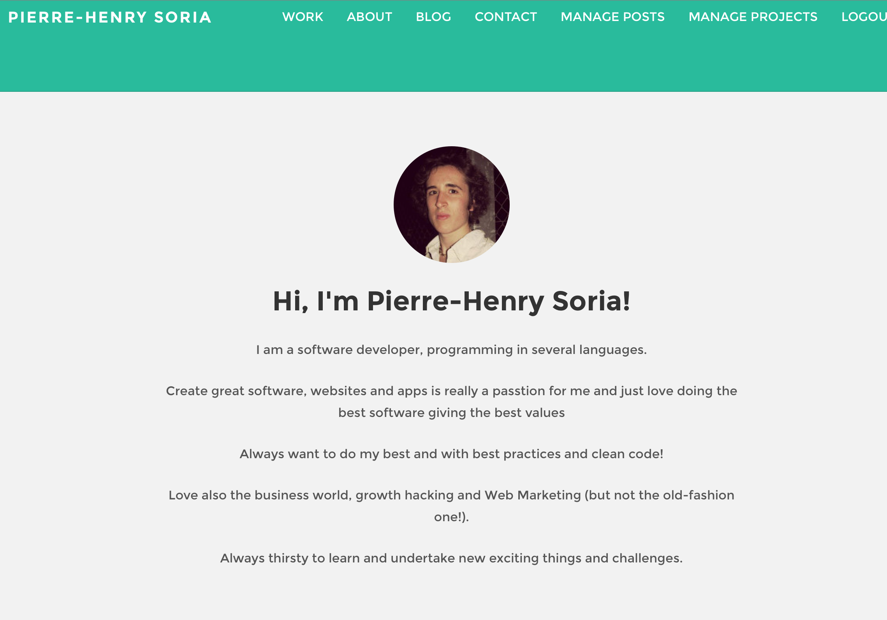

# pH7Ortfolio

**pH7Ortfolio** is my simple portfolio website built with MeteorJs and Bootstrap frameworks.

If you like Meteor.js like me, you can see others [I made here](https://github.com/AwesomeMobileApps) but there are not completely finished (sorry :smiley:).

## Requirements

- Your server needs [Node.js](http://nodejs.org/) installed.

- On production, don't forget to remove the Meteor *insecure* package, by typing the following in your project `meteor remove insecure`.

## Deployment
### (generic tutorial, not only for this app)

The easiest way to deploy and put your app live (to the galaxy, and beyond! :D), is by creating an account to [Meteor.com](https://www.meteor.com/sign-up), -> Galaxy App Hosting -> Signup for "Galaxy App Hosting" ($0.04/Container-Hour, not free anymore :( ).

Then -> Meteor Account Services -> New Application.

After, just go to your Meteor project through your console -> `meteor deploy <MY_APP_NAME>.meteor.com`, enter your Meteor login and your app will be on the Galaxy (live) and available on the URL, `<MY_APP_NAME>.meteor.com`

## Author

**[Pierre-Henry Soria](https://github.com/pH-7/)**

## Contact

You can send an email at **pierrehenrysoria+github {{AT}} gmail {{D0T}} COM**

## How pH7Ortfolio Looks Like?

## License

[MIT License](http://opensource.org/licenses/mit-license.php)
